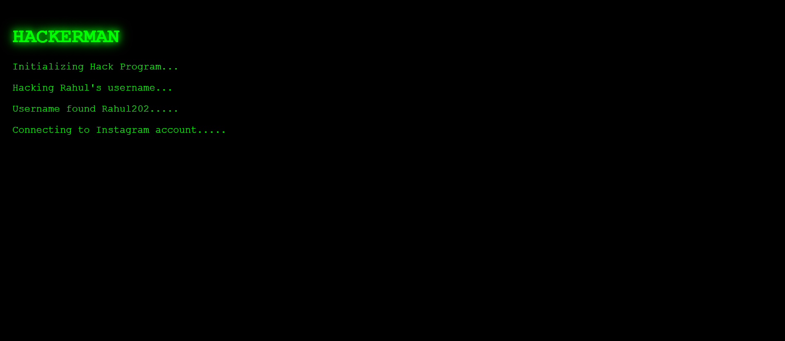

# 🟢 Hackerman – Terminal Style Hacking Simulator


## 🚀 Overview

Hackerman is a fun and interactive JavaScript project that simulates a classic hacker-style terminal interface. Inspired by the green-on-black command-line aesthetic seen in movies, this project creates a realistic “hacking” experience using dynamic text rendering and asynchronous JavaScript.

It demonstrates core frontend development concepts like **DOM manipulation**, **async/await**, and **timed execution**, all wrapped in a visually engaging UI.

---

## ✨ Features

* 🖥️ Terminal-style hacker interface
* ⏳ Async/Await based message sequencing
* ⚡ Real-time dynamic text rendering
* 🎨 Minimalistic green-on-black UI
* ⌨️ Simulated hacking messages
* 🔁 Easy to customize and extend

---

## 🛠️ Tech Stack

* **HTML** – Structure
* **CSS** – Styling (terminal theme)
* **JavaScript** – Logic & interactivity

---

## 📂 Project Structure

```
Hackerman/
│── index.html
│── style.css
│── script.js
│── screenshot.png
```

---

## ⚙️ How It Works

The project uses **async/await** to display messages one after another with delays, creating a realistic terminal output effect.

Example:

```javascript
async function showMessage(text) {
    return new Promise((resolve) => {
        setTimeout(() => {
            console.log(text);
            resolve();
        }, 1000);
    });
}
```

---

## ▶️ Getting Started

1. Clone the repository:

```bash
git clone https://github.com/your-username/hackerman.git
```

2. Open the project folder:

```bash
cd hackerman
```

3. Run the project:

* Open `index.html` in your browser

---

## 💡 Future Improvements

* 🔊 Add sound effects (typing / hacking sounds)
* ⌨️ Typing animation instead of instant text
* 🎯 User input (target name simulation)
* 🌧️ Matrix rain effect
* 🌐 Deploy live using GitHub Pages

---

## 📸 Screenshot




## 🤝 Contributing

Contributions are welcome! Feel free to fork this repo and improve the project.

---

## 📜 License

This project is open-source and available under the **MIT License**.

---

## ⭐ Show Your Support

If you like this project, give it a ⭐ on GitHub!

---

## 👨‍💻 Author

**Rahul Dutta**

---

✨ *“Code like a hacker, build like a developer.”*
